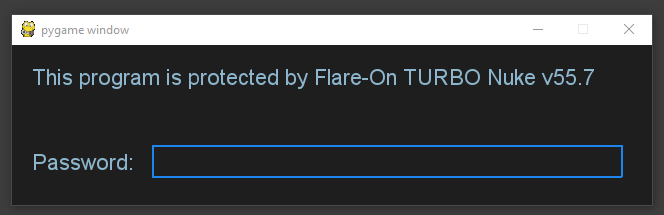
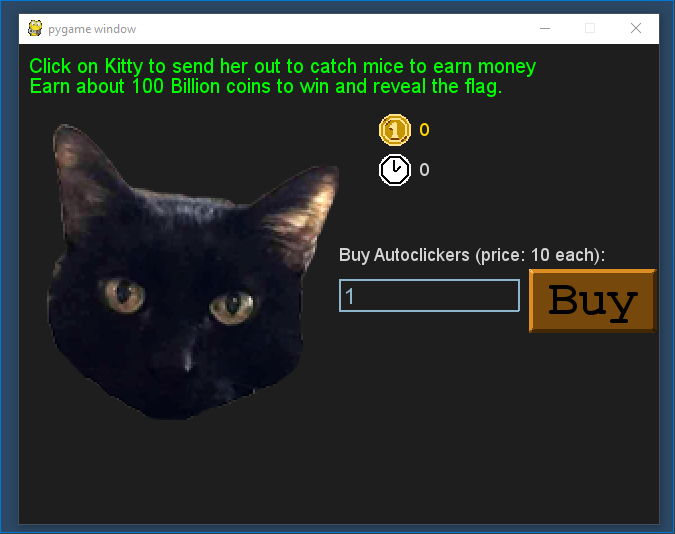
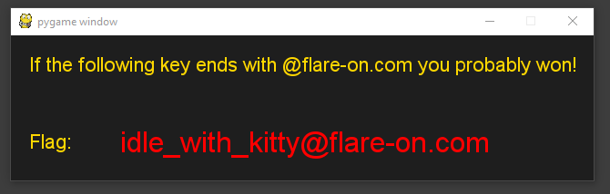

# 1 - Fidler

## Description

Welcome to the Seventh Flare-On Challenge!

This is a simple game. Win it by any means necessary and the victory screen will reveal the flag. Enter the flag here on this site to score and move on to the next level.

This challenge is written in Python and is distributed as a runnable EXE and matching source code for your convenience. You can run the source code directly on any Python platform with PyGame if you would prefer.

## Walkthrough

The first we do is executing the _Python_ script as follows (remember installing _pygame_ first):

```
C:\> python3 fidler.py
```

The following screen will appear:



So we need to find out the password. To do so we check the source code of the application. The first thing that draws our attention is the function _check_password_ at the begining of the source code.

```
def password_check(input):
    altered_key = 'hiptu'
    key = ''.join([chr(ord(x) - 1) for x in altered_key])
    return input == key
```

So we can modify it to print out the real password when we enter whatever data.

```
C:\> python3 fidler.py

ghost
```

Great! Now we can see the second screen:



If we check the source code, we see the following sentence in the _game_screen_ function:

```
	target_amount = (2**36) + (2**35)
        if current_coins > (target_amount - 2**20):
            while current_coins >= (target_amount + 2**20):
                current_coins -= 2**20
            victory_screen(int(current_coins / 10**8))
            return
```

This means that we must achieve a total ammount of...

```
(2^36 + 2^35) - (2^20) = 103079215104
```

... coins to get the key. This means that we have to perform this ammount of clicks on the kitty, something impossible. So instead, we modify the source code, specifically the _cat_clicked_ function, to get the necessary coins to get the flag:

```
def cat_clicked():
	global current_coins
    current_coins += 1000000000000
    return
```

Finally, we got the key!

```
idle_with_kitty@flare-on.com
```


