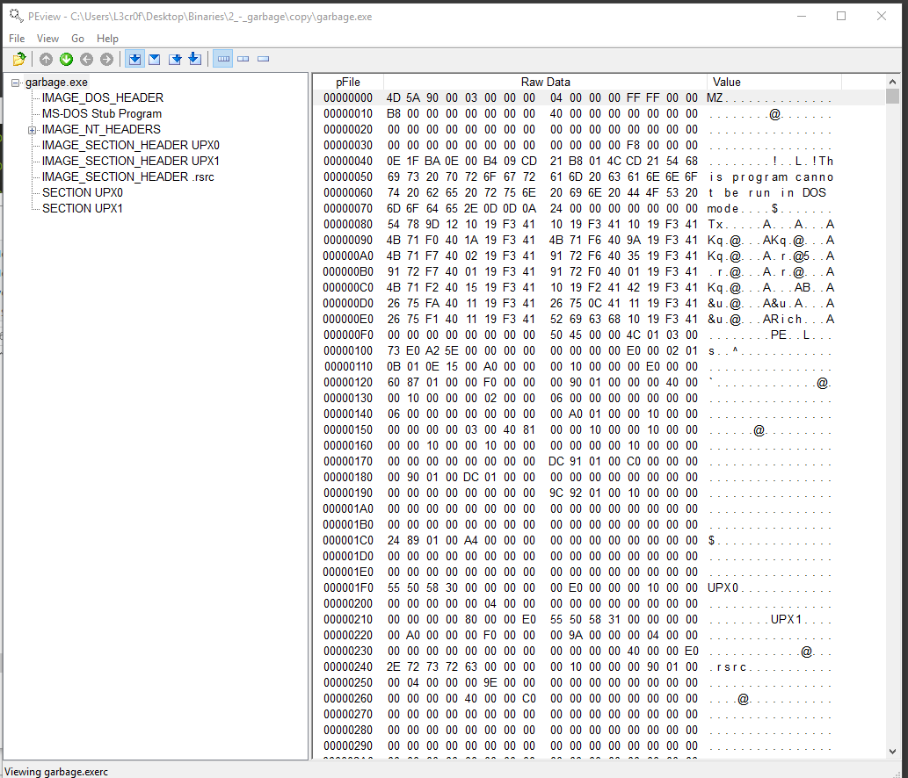
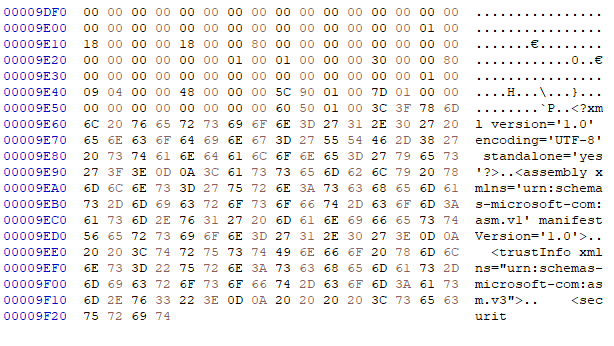
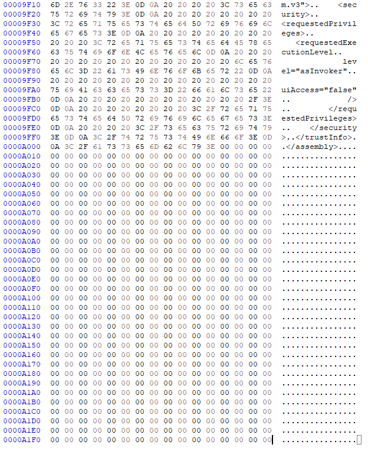
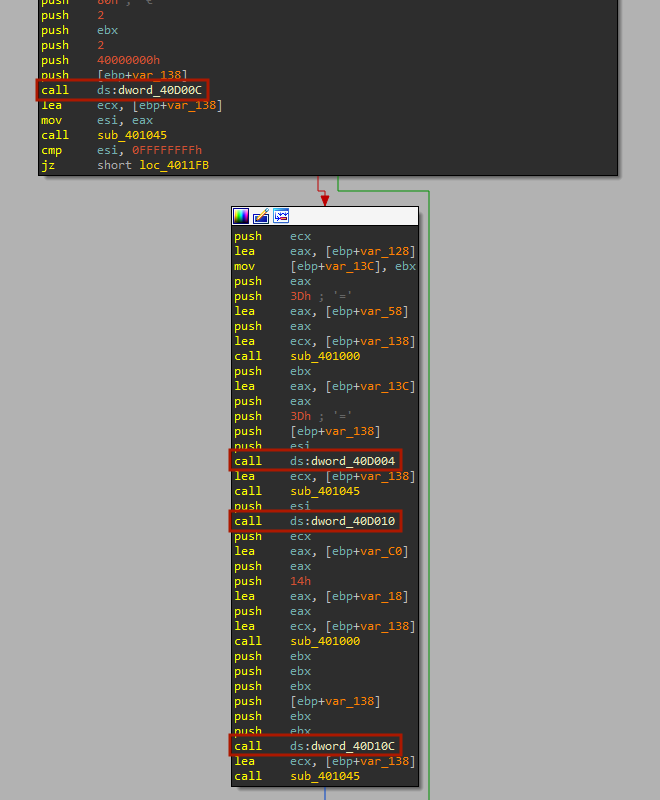
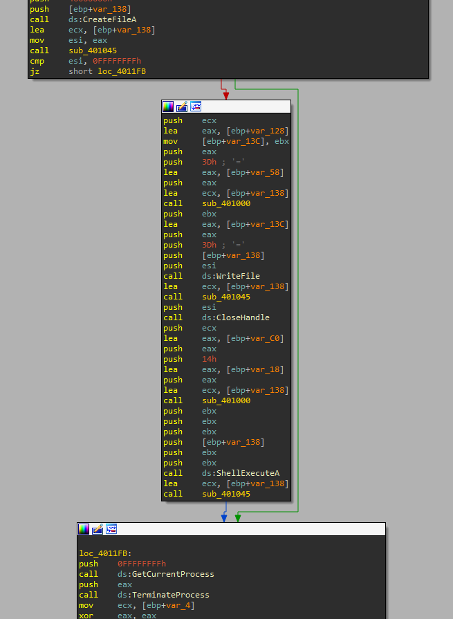
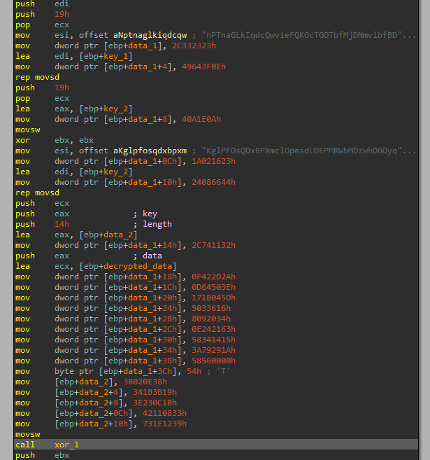
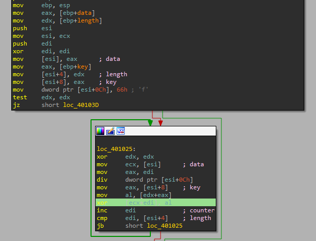

# 2 - Garbage

## Description

One of our team members developed a Flare-On challenge but accidentally deleted it. We recovered it using extreme digital forensic techniques but it seems to be corrupted. We would fix it but we are too busy solving today's most important information security threats affecting our global economy. You should be able to get it working again, reverse engineer it, and acquire the flag.

## Walkthrough

We open the file in a PE viewer like _PEview_ and we check some interesting stuff like the _UPX_ headers that indicates that the file is packed with _UPX_:



However, if we try to unpack it, we see the following error code:

```
C:\> upx -d garbage.exe -o garbage_unpacked.exe
                       Ultimate Packer for eXecutables
                          Copyright (C) 1996 - 2018
UPX 3.95w       Markus Oberhumer, Laszlo Molnar & John Reiser   Aug 26th 2018

        File size         Ratio      Format      Name
   --------------------   ------   -----------   -----------
upx: garbage.exe: OverlayException: invalid overlay size; file is possibly corrupt

Unpacked 1 file: 0 ok, 1 error.
```

We need to recover the file first, at least to unpack it properly.

If we take a look to the headers, everything seems to be ok, but if we take a look to the end of the file, we see the following:



The file suddenly ends! Well, more specifically, the _.rsrc_ section suddenly ends. Let's try to recover it and see if we can unpack it.

We see in the resource section header the following info about the section:

```
size = 0x400
pointer raw data = 0x9E00
```

So the section should ends at _0xA200_, but ends at _0x9F20_, we must fill it wiht _0x2E0_ bytes. To do so, we take the end of the resource section of the file "C:\Windows\SysWOW64\cmdkey.exe" and a bunch of null bytes:



Now, let's try to unpack it:

```
C:\> upx -d garbage.exe -o garbage_unpacked.exe
                       Ultimate Packer for eXecutables
                          Copyright (C) 1996 - 2018
UPX 3.95w       Markus Oberhumer, Laszlo Molnar & John Reiser   Aug 26th 2018

        File size         Ratio      Format      Name
   --------------------   ------   -----------   -----------
     79360 <-     41472   52.26%    win32/pe     garbage_unpacked.exe

Unpacked 1 file.
```

Great! Now we can view the assembly code in _IDA Pro_. However, the imports seems to be corrupted.



To fix them, we decided to assume that the base address of the IAT is _0xC200_ (_PEview_), instead of _0xD000_ (_IDA Pro_). This gives us the following functions:



Now we can analyze the sample better.

After digging a little bit into the sample, we see two interesting functions that executes some XOR encoding operations, but the one at _0x401000_ seems to be the more interesting one (renamed to _xor_1_). This function uses some encoded data and what seems to be the decryption keys that are stored as variables.





The _xor_1_ function executes the following code:

```
mov     dword ptr [esi+0Ch], 66h ; 'f'
...
xor     edx, edx		-> EDX = 0
mov     ecx, [esi]		-> ECX = DATA
mov     eax, edi		-> EAX = COUNTER
div     dword ptr [esi+0Ch]		->  EAX = EDX:EAX / 0x66 | EDX = EDX:EAX % 0x66
mov     eax, [esi+8]		-> EAX = KEY
mov     al, [edx+eax]		-> AL = KEY[EDX]
xor     [ecx+edi], al		-> ECX[COUNTER] = ECX[COUNTER] ^ KEY[EDX]
inc     edi			-> COUNTER++
cmp     edi, [esi+4]		-> if (COUNTER < LENGTH)
jb      short loc_401025
```
Which we have converted (including the encrypted data and the keys) to the python script located in the same path with the name _garbage_xor.py_. 

```
$ python3 garbage_xor.py 

The decrypted strings are:
sink_the_tanker.vbs
MsgBox("Congrats! Your key is: C0rruptGarbag3@flare-on.com")
```

Great! We have obtained the flag!
