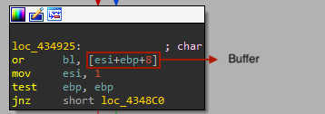

# 3 - Wednesday

## Description

Be the wednesday. Unlike challenge 1, you probably won't be able to beat this game the old fashioned way. Read the README.txt file, it is very important.

## Walkthrough

This time we have to analyze a game written in Nim called _mydude.exe_.

The first thing we try to do is beating this game by modyfing our score. To do so, we get to an interesting function called _@update__Arw3f6ryHvqdibU49aaayOg@12_ at _0x433D20_. At the end of this function we can see how a comparison is made between a value (the current score) and the value 0x128, if the comparison is successful, the function _@sceneeq___HC7o4hYar8OQigU09cNyehg@8_ (_0x42C2C0_) is called with the variable _\_winScene__eVaCVkG1QBiYVChMxpMGBQ_ as argument, which suggest that this could be the screen window we are looking for.


So we set a breakpont at _0x433FAD_ and modify the value of the score to 0x128, but... It terminates, probably an exception occurred, let's change the approach. This time, we modify the binary so as to win at the 8th obstacle.

Great! We have won! But any flag has been displayed, only an extrange '1', probably is the beginning of the flag. This means that the flag is being filled as you play.

If we dig a little bit into the function called, we arrive at the function at _0x434880_, called _@getPlayerText__Uox5Ls3Q9bP7F7vcih9ag2vQ@4_. This seems to be the function in charge to get the flag, so we rename it to _getFlag_.


If we debug this function, we see that the flag is being generated according to a buffer, which first 8 bytes are the following:

```
0 0 1 1 0 0 0 1
```



Mmmmm... This seems like the 8 first obstacles of the game:

```
0    0    1  1  0    0    0    1
down down up up down down down up
```

So the key must be the obstacles of the game, so these elements cannot be randomly generated.

We start looking for how the obstacles are generated until we get to the function _@assignDay__cz9bfHkuka9cVFg87ZfWKc8g@8_ (0x4317D0), which has a promising name. There we see a lot of garbage code that involves randomly generated data and hashing, but at the begining of the function we see a comparison that forks the graph in two paths, both of each calls the same function, _@sample__3xfZAw0SQXCnAoXzmGGnMA@8_ (_0x418BF0_).


If we debug the sample, we see that if the comparison is succesfull, the _up_ obstacles are generated, but, if not, the _down_ obstacles are the generated ones. So the the key is at _EDX_.

If we go backwards at which the function is called, we will arrive to two functions, but the one with the name _@reset__SAtOZDlchGyR6ynmbkI6aw@24_ (_0x431A20_) looks more interesting.


There we see that the value we are looking for is stored in the _arg_0_ variable, so we have to check when this data was pushed to the stack prior calling this function. This leads to the function _@update__Arw3f6ryHvqdibU49aaayOg@12_ (_0x433D20_), the same where the score comparison is made.

If we take a look to the instructions prior the function _@reset__SAtOZDlchGyR6ynmbkI6aw@24_ is called, we will see the following.


As we can see, the variables are not pushed, but stored directly in the stack. The one we are looking for is the instruction:

```
mov     [esp+3Ch+var_2C], eax
```

If we look backwards, we will see the following instructions that modifies _EAX_:

```
mov     esi, ds:_day_index__HImZp3MMPNE3pGzeJ4pUlA		-> ESI = current day index
add     esi, 1							-> ESI = ESI + 1 (next day index)
mov     edi, esi						-> EDI = ESI
...
mov     eax, _obstacles__Xqz7GG9aS72pTPD9ceUjZPNg		-> EAX = 0x43EB40
...
mov     edx, [eax]						-> EDX = buffer at 0x43EB40
...
movsx   eax, byte ptr [eax+edi+8]				-> EAX = buffer at 0x43EB48 + day index

```

So, if we take a look at _0x43EB48_, we will see the following data:

```
.rdata:0043EB48 00                                   db    0
.rdata:0043EB49 00                                   db    0
.rdata:0043EB4A 01                                   db    1
.rdata:0043EB4B 01                                   db    1
.rdata:0043EB4C 00                                   db    0
.rdata:0043EB4D 00                                   db    0
.rdata:0043EB4E 00                                   db    0
.rdata:0043EB4F 01                                   db    1
.rdata:0043EB50 00                                   db    0
.rdata:0043EB51 01                                   db    1
.rdata:0043EB52 01                                   db    1
.rdata:0043EB53 01                                   db    1
.rdata:0043EB54 00                                   db    0
.rdata:0043EB55 01                                   db    1
.rdata:0043EB56 00                                   db    0
...
```

Mmmmm... Sounds like the obstacle positions of the game! Also the data has a length of _0x128_!

We have developed a _Python_ script that executes the algorithm of the _getFlag_ function to see if this is the data we were looking for and (the script name is _flag_decoder.py_)...

```
$ python3 flag_decoder.py 

1t_i5_wEdn3sd4y_mY_Dud3s@flare-on.com
```

Great!!
