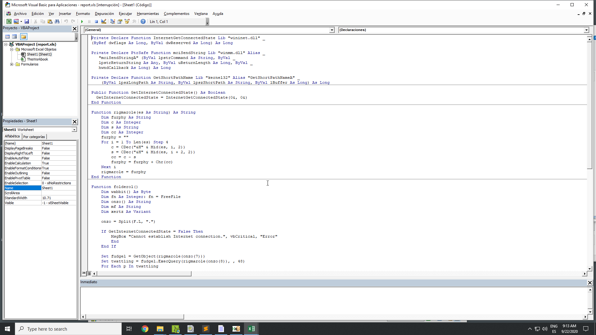
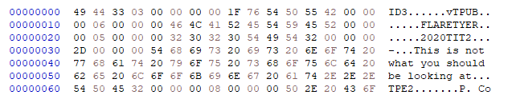

# 4 - Report

## Description

Nobody likes analysing infected documents, but it pays the bills. Reverse this macro thrill-ride to discover how to get it to show you the key.

## Walkthrough

The first thing we do is opening the _Excel_ file, which prompts us with the error "Invalid procedure call argument". However, we can see the macro.



We can see how the macro seems to be obfuscated, but can copy it to another _Excel_ file to try to run it (do not forget the _Form_, which seems to contain some encrypted data).

Now, if we run it, we have to have Internet connection, since the code checks so.

```
    If GetInternetConnectedState = False Then
        MsgBox "Cannot establish Internet connection.", vbCritical, "Error"
        End
    End If
```

We can remove this piece of code in order to execute the macro.

After that, will see an error message that says that our machine is not suported, but it seems to be an anti-debugging mechanism that lists all the processes of the machine and if the strings "vmw" or "vmt" are found, it stops the process.

```
    Set fudgel = GetObject(rigmarole(onzo(7)))
    Set twattling = fudgel.ExecQuery(rigmarole(onzo(8)), , 48)
    For Each p In twattling
        Dim pos As Integer
        pos = InStr(LCase(p.Name), "vmw") + InStr(LCase(p.Name), "vmt") + InStr(LCase(p.Name), rigmarole(onzo(9)))
        If pos > 0 Then
            MsgBox rigmarole(onzo(4)), vbCritical, rigmarole(onzo(6))
            End
        End If
    Next
```

As previously done, we can simply remove such code.

Now, the macro can be successfully executed. However... We only hear some "knocks". Mmmm... If we print the following, we will see some interesting data:

```
Debug.print rigmarole(onzo(0))
Debug.print rigmarole(onzo(1))

AppData
\Microsoft\stomp.mp3
```

Now everything has sense, so we open this file in an hex editor and...



Nop! WE have to dig deeper.

If we take a look to the "rigmarole" function, it seems to decrypt some strings stored in the first field of the form. We can try to create an script to decrypt all of them, since it seems that some are not even used.

The script is stored in "Scripts/decrypt_strings.py":

```
$ python3 decrypt_strings.py

0 - AppData
1 - \Microsoft\stomp.mp3
2 - play 
3 - FLARE-ON
4 - Sorry, this machine is not supported.
5 - FLARE-ON
6 - Error
7 - winmgmts:\\.\root\CIMV2
8 - SELECT Name FROM Win32_Process
9 - vbox
10 - WScript.Network
11 - \Microsoft\v.png
```

Great! It seems that it can create a PNG image, but how!?

We need to analyze the "P-Code" of the _Excel_ file in order to get the real code. To do so, we use the tool called _pcodedmp.py_ as follows:

```
C:\> pcodedmp.exe report.xls > pcodedmp_report.txt
```

Now, we can check what differences we can find between the hidden code and the visible one.

Before calling the function "canoodle" (which seems to be the responsible for decrypting the file), we can see how another key is used, called firkin, instead of `xertz = Array(&H11, &H22, &H33, &H44, &H55, &H66, &H77, &H88, &H99, &HAA, &HBB, &HCC, &HDD, &HEE)`.

```
Line #60:
	Ld firkin 
	FnLen 
	St n 
Line #61:
	StartForVariable 
	Ld i 
	EndForVariable 
	LitDI2 0x0001 
	Ld n 
	For 
Line #62:
	Ld firkin 
	Ld i 
	LitDI2 0x0001 
	ArgsLd Mid$ 0x0003 
	ArgsLd Asc 0x0001 
	Ld n 
	Ld i 
	Sub 
	ArgsSt buff 0x0001 
Line #63:
	StartForVariable 
	Next 
```

This translates to:

```
Set groke = CreateObject(rigmarole(onzo(10)))
firkin = groke.UserDomain
groke = CreateObject(rigmarole(onzo(10)))
firkin = groke.UserDomain
n = Len(firkin)
For i = 1 To n
	buff(n - i) = Asc(Mid(firkin, i, 1))
Next
```

Remember that `rigmarole(onzo(10))` translates to "WScript.Network", so it request the UserDomain of the machine, which may be different in every system, but...

```
Line #55:
	Ld firkin 
	LitDI2 0x0003 
	ArgsLd onzo 0x0001 
	ArgsLd rigmarole 0x0001 
	Ne 
	IfBlock 

If firkin != "FLARE-ON"

```

Great! "firkin" have to be "FLARE-ON"!

Also, when it calls to "canoodle", it changes the code as follows:

```
VISIBLE

	wabbit = canoodle(F.T.Text, 0, 168667, xertz)

HIDDEN
	wabbit = canoodle(F.T.Text, 2, 285729, buff)
```

Now we can modify the visual basic script or made a new one, in my case I have developed a _Python_ one located at "Scripts/get_flag.py":

```
$ python3 get_flag.py
```


Great! The flag is: `thi5_cou1d_h4v3_b33n_b4d@flare-on.com`.