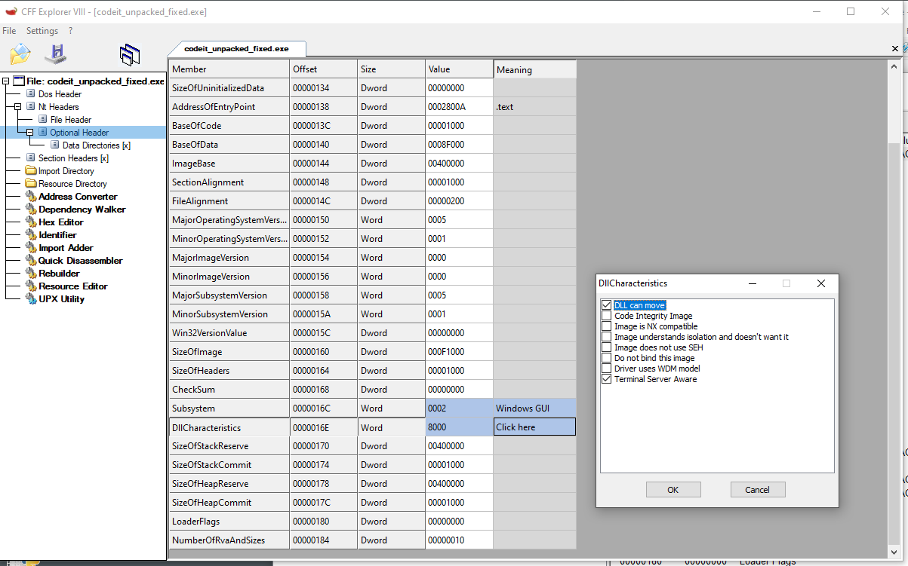

# 6 - CodeIt

## Description

Reverse engineer this little compiled script to figure out what you need to do to make it give you the flag (as a QR code).

## Walkthrough

When we open this binary in a tool such as _PEview_ we can see that is packed using _UPX_, so we need to unpack it prior analyzing.

```
C:\> upx -d codeit.exe -o codeit_unpacked.exe
```

To load it in _IDA Pro_ we need to select _Manual Load_ and select _0x00400000_ as preferred _Image Base_, if we do not do so, we will see how it is loaded whatever it considers and thus, it will not be properly analyzed.

However, if we run it, the sample will be loaded at a random address, which will cause that the fixed memory addresses will cause memory corruption accesses.

To solve this, we have to disable the _IMAGE_DLLCHARACTERISTICS_DYNAMIC_BASE_ of the _DLL Characteristics_ field of the _PE Optional Header_ so as to remove _ASRL_. This can be done using _CFF Explorer_.



Now, we can execute the sample and also debug it, but... An error message telling us "This is a third-party compiled AutoIt 
script." will be prompted.

So now we know it has been coded using _AutoIt_, which can be decompiled using the _Exe2Aut_ utility.

The resulting file is a completely executable file of _AutoIt_ source code (similar to _Basic_ language), wich can be executed using the _AutoIt_ engine.

However, these steps could be simplified by executing the _Exe2Aut_ utility with the original binary.

