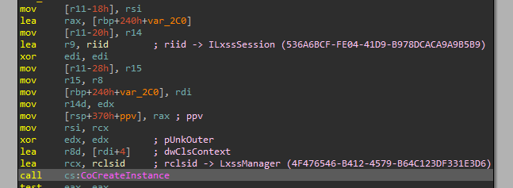
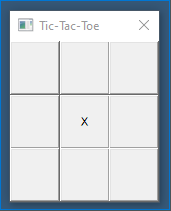
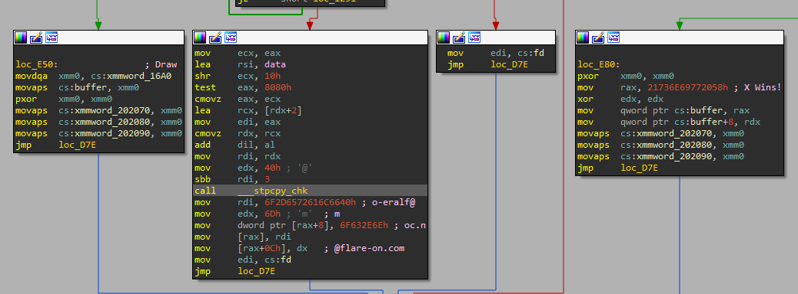
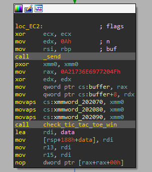
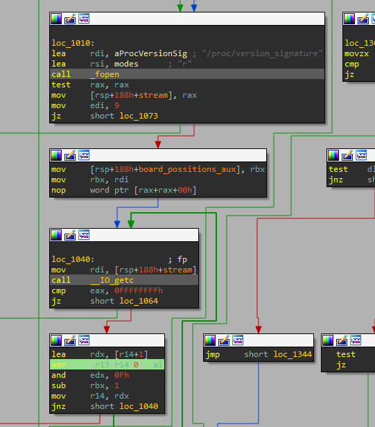
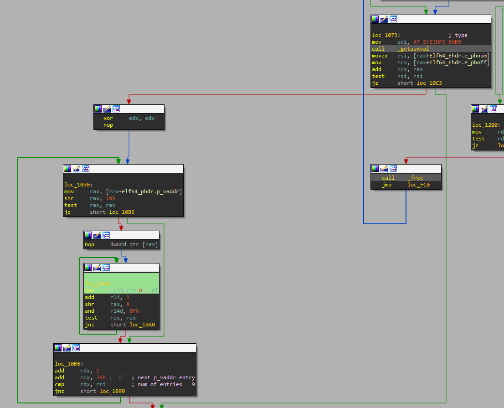
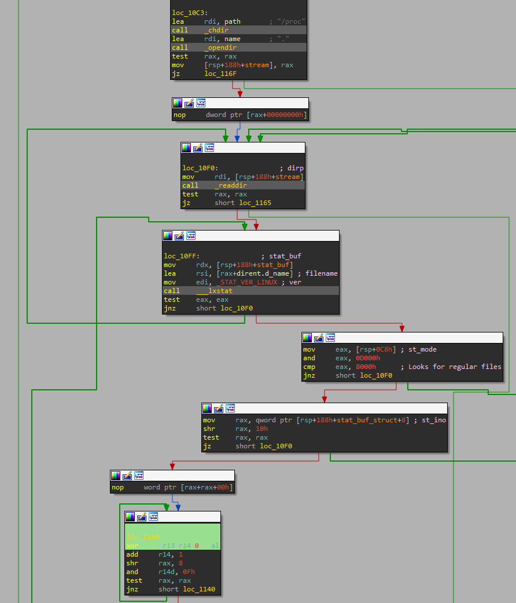
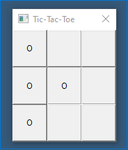
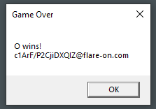

# 8 - Aardvark

## Description

Expect difficulty running this one. I suggest investigating why each error is occuring. Or not, whatever. You do you.

## Walkthrough

This program cannot be executed directly, since it needs something to be installed.

If we take a look to the original errors related with COM initialization, we will arrive at a function (_0x00007FF664CE1FB0_) within the code that will execute the following interface of the following COM object:

```
CLSID: 4F476546-B412-4579-B64C123DF331E3D6 -> LxssManager
IID: 536A6BCF-FE04-41D9-B978DCACA9A9B5B9 -> ILxssSession
```



As we can see, it tries to use the _WSL_ feature of Windows, so we need to enable it (do not forget to enable the _Hyper-V_ and virtualization properties of the virtual machine) and installing a virtual machine, _Ubuntu_ in our case. After that, if we execute the sample, we can see it running or not, depending whether we have installed _WSL_ 2, which will not run, or _WSL_ 1, which is the appropiate.



If we continue analyzing the code, we can see how it gets some _ELF_ binary from the resources, copies it to the temporal folder and executes it using the default _WSL VM_.

The main functionality of the sample seems to be done in the _ELF_ binary, the _PE_ one only sends the movements and receives the results through a socket called "496b9b4b.ed5".

If we take a look at the _ELF_ file we see that it will print the flag if the 'O' letter wins.



So we need to analyze where the flag is loaded and modified. This leads us to the following piece of code at _0x0EC2_:



After loading the data, the binary applies the following decoding routines:

- Apply an _XOR_ operation between every byte of the data and the letter 'O' (_0x4F_ in hexadecimal).
- As long as the file "/proc/modules" exists and has the module "cpufreq_" loaded , apply an _XOR_ operation between every byte of the string "cpufreq_" and the corresponding bytes of the data according to a global counter that cannot be greater than _0xF_, so it is restored to _0x0_ after reaching this value.
- As long as the file "/proc/mounts" exists and has a field with the second column equal to "/" , apply an _XOR_ operation between every byte of the third column from the letter "f" (eg. "wfs" will avoid the first letter) and the corresponding bytes of the data according to a global counter that cannot be greater than _0xF_, so it is restored to _0x0_ after reaching this value.
- As long as the file "/proc/version_signature" exists, apply an _XOR_ operation between the first nine bytes or until the end of file and the corresponding bytes of the data according to a global counter that cannot be greater than _0xF_, so it is restored to _0x0_ after reaching this value.



- Apply an _XOR_ operation between every value of the _virtual address_ of each _PHeader_ entry of the _ELF_ file, shifted to the right _0x10_ units in the first iteration and _0x8_ units in the following ones and only if the result of such operations are greater than 0, and the corresponding bytes of the data according to a global counter that cannot be greater than _0xF_, so it is restored to _0x0_ after reaching this value.



- Apply an _XOR_ operation between every _inode_ value of the regular files at "/proc/", shifted to the right _0x10_ units in the first iteration and _0x8_ units in the following ones and only if the result of such operations are greater than 0, and the corresponding bytes of the data according to a global counter that cannot be greater than _0xF_, so it is restored to _0x0_ after reaching this value.



All these steps have been translated to a python script, however, the flag did not appeared, much more analysis have to be done, since there is some mistake that we have not found yet.

However, another way to get the flag comes to my mind... Patching the game so it can only print the letter 'O'! We do this by changing the value of the letter "X" to the value of the letter "O" at _0x0CDC_. After that, we execute it and, if we do get a complete line in the left  (we can get the flag with other winning movements, but not with all of them), the flag will be revealed!





The flag is: `c1ArF/P2CjiDXQIZ@flare-on.com`